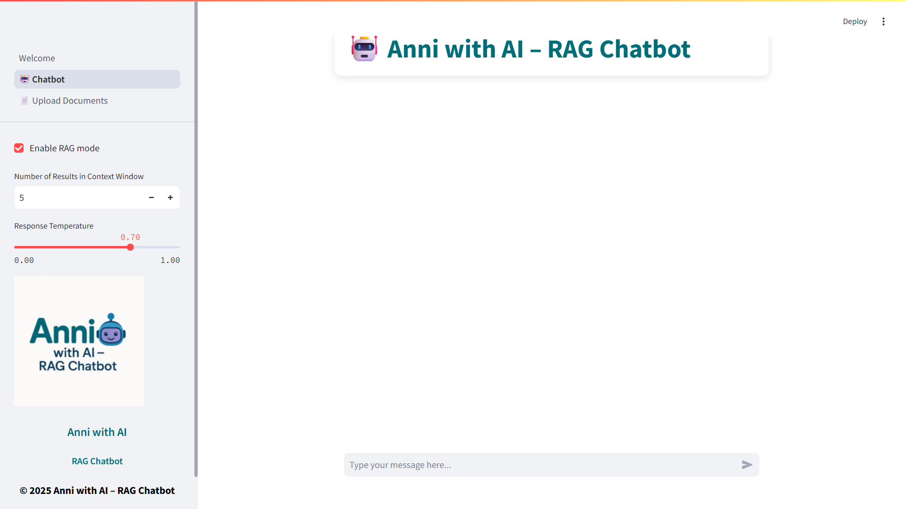
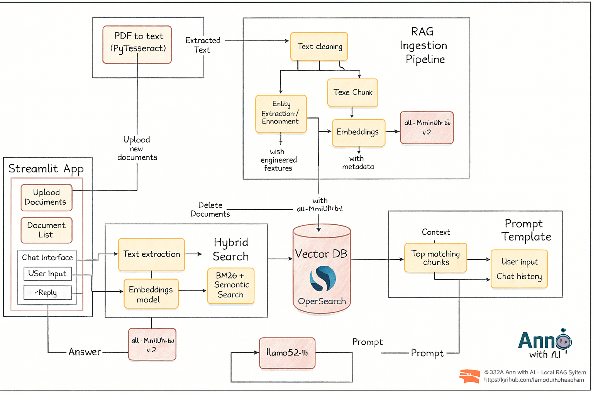

🧠 Anni with AI – Local LLM-Based RAG System
==========================================

**Private • Offline • OpenSearch-Powered • Streamlit UI • Docker-Ready**

This project provides a **fully offline, privacy-preserving Retrieval-Augmented Generation (RAG) system** powered by **local Large Language Models (LLMs)**.  
It enables users to chat with their own documents using **OpenSearch hybrid search** and **local inference via Ollama**, without relying on any cloud APIs.

The application features a **Streamlit-based chatbot interface** and is **Docker-ready** for easy deployment.

---

🖼 User Interface
----------------

<div align="center">
  
</div>

---

🧩 System Architecture
----------------------

<div align="center">
  
</div>

---

🚀 Features
-----------

- 📄 Upload and index **PDF documents**
- 🧠 **Hybrid search** (BM25 + Semantic Vector Search) using OpenSearch
- 🤖 **Local LLM inference** via Ollama (no cloud APIs)
- 🔐 **100% offline & privacy-friendly**
- 🎨 Clean and interactive **Streamlit chatbot UI**
- 🌡 Adjustable **temperature & Top-K retrieval**
- 🧠 Chat history memory for better context
- 🐳 **Docker & Docker Compose** support

---

🧩 Tech Stack
-------------

- **LLM:** Ollama (llama3.x, custom local models)
- **Vector DB:** OpenSearch
- **Embeddings:** Sentence Transformers
- **OCR:** PyPDF2 / Tesseract (optional)
- **Frontend:** Streamlit
- **Backend:** Python
- **Deployment:** Docker, Docker Compose

---

📁 Project Structure
--------------------

```text
Anni-with-AI/
│
├── README.md
├── chatbot2.png
├── Anni_AI_Fig.png
├── Welcome.py              # Streamlit entry point
├── src/
│   ├── ingestion.py        # Document ingestion & indexing
│   ├── retrieval.py        # Hybrid search logic
│   ├── rag_pipeline.py     # RAG orchestration
│   ├── constants.py        # Configurations
│
├── docker-compose.yml      # OpenSearch & services
├── requirements.txt
````

---

## ⚙️ Setup & Installation

### 1️⃣ Clone the Repository

```bash
git clone https://github.com/Anirudh-chaudhari/Anni-with-AI-Local-LLM-based-RAG-System-OpenSearch-Streamlit-Docker-.git
cd Anni-with-AI-Local-LLM-based-RAG-System-OpenSearch-Streamlit-Docker-
```

---

### 2️⃣ Create Conda Environment

```bash
conda create -n rag311 python=3.11 -y
conda activate rag311
```

---

### 3️⃣ Install Dependencies

```bash
pip install -r requirements.txt
```

---

### 4️⃣ Start OpenSearch (Recommended)

```bash
docker-compose up -d
```

---

### 5️⃣ Run the Application

```bash
streamlit run Welcome.py
```

---

## 🌐 Access the Application

```
http://localhost:8501
```

---

## 🔧 Configuration

All configurable parameters are defined in:

```
src/constants.py
```

| Variable               | Description          |
| ---------------------- | -------------------- |
| `OLLAMA_MODEL_NAME`    | Local LLM name       |
| `EMBEDDING_MODEL_PATH` | Embedding model path |
| `OPENSEARCH_INDEX`     | Vector index name    |
| `TEXT_CHUNK_SIZE`      | Chunk size           |
| `EMBEDDING_DIM`        | Embedding dimension  |
| `OPENSEARCH_HOST`      | Default: localhost   |
| `OPENSEARCH_PORT`      | Default: 9200        |

---

## 📌 Use Cases

* 📚 Private document Q&A
* 🏢 Enterprise knowledge bases
* ⚖️ Legal / medical document analysis
* 🎓 Academic research assistants
* 🔐 Offline AI chatbots

---

## 🖋 License

MIT License
© 2024 Anirudh Chaudhari

---

## 👨‍💻 Author

**Anirudh Chaudhari**
AI/ML Engineer | RAG Systems | Local LLMs | Computer Vision

🔗 GitHub:
[https://github.com/Anirudh-chaudhari](https://github.com/Anirudh-chaudhari)
